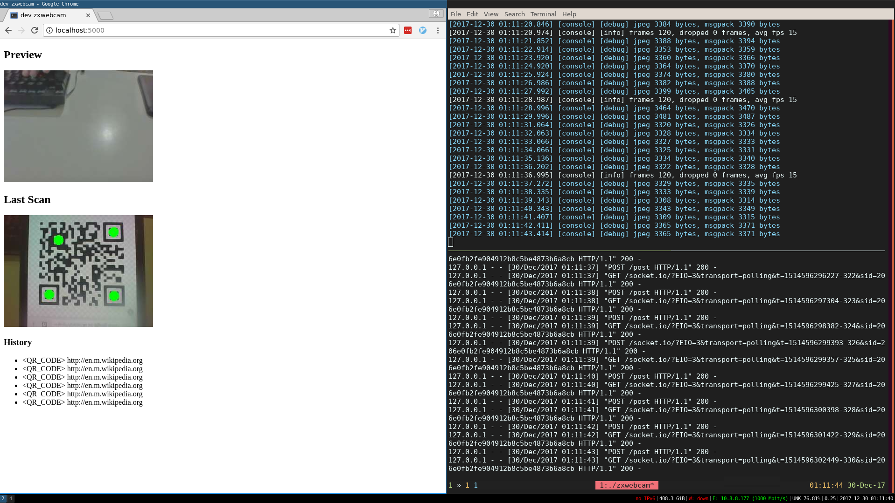

# zxwebcam

toy utility to grab frames from a v4l-supported webcam, decode
any barcodes captured and send the results via HTTP to another
service.

works decently on a RaspberryPi 3 at about 15fps and with the capture 
resolution set to 320x240.

uses msgpack to encode the POST payload. `dev_server/` has an example
python webapp that displays scan results and previews webcam output.



currently has a hardcoded 2 second backoff to prevent duplicate reads, see
`poster_thread.h/cxx`.

run without any args to see cmdline opts.

## compiling

```
# from the cloned source directory
git submodule update --init --recursive
mkdir build
cd build
cmake ..
cmake --build .
```

## requirements

The following packages on debian

```
apt install cmake g++ build-essential libv4l-dev libjpeg-dev libcurl4-openssl-dev
```

## libs

* zxing-cpp: https://github.com/nu-book/zxing-cpp/
* CImg: http://cimg.eu
* args: https://github.com/taywee/args
* spdlog: https://github.com/gabime/spdlog
* cpr: https://github.com/whoshuu/cpr
* msgpack-c: https://github.com/msgpack/msgpack-c
